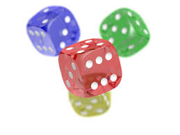
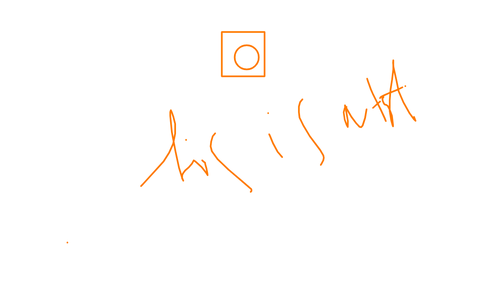
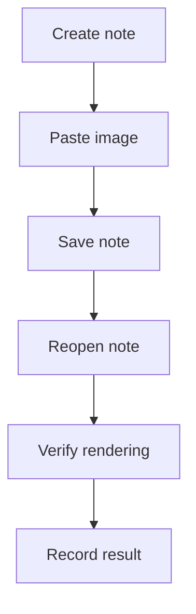
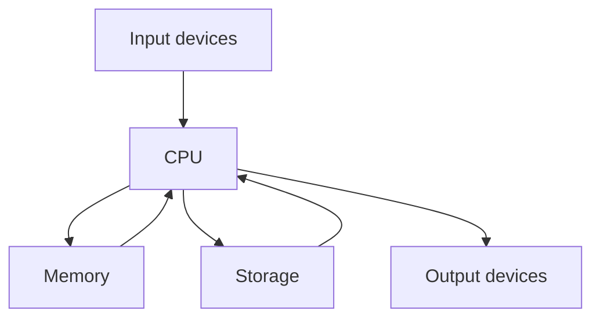

# Image Test

There is this something that needs to be fixed!

# Semantic Smoke
blue copper zettelkasten retrieval phrase       
What is going on?

# Semantic Test 2
This is another test!

## Goal
Test Xandria note capabilities systematically, starting with image handling.

I am making some changes here in remote!

ANd this are some changes here from new save!

This save is from background sync - Lets hope so! 

This commit is from Agent

This commit is from Agent 2nd

What is wrong,** does this note** even auto save?
Nothing it still doesnt save. 

Does auto save work now!
I am not sure, how good this save is? 
ANd not only that, what is wrong, with that though! 
What is going on now, and not that I want to do something with that! 
And I think, 2 s is better for auto save!

## What I want to verify
- Image paste works

- Image renders correctly in the note preview/editor
- Relative image path is stored correctly
- Note remains stable after reopen
- Multiple images render correctly in one note
- Searchability of note title/metadata
- Backlinks or source-link behavior if applicable
## Current test items
### 1. Pasted image (PNG)
**Status:** Needs re-test
**What I did:** Pasted an image into the note.
**Observed result:** Image reference is present in the note.
**Expected result:** Image should render reliably and persist after reopening.

### 2. Pasted image (JPG)
**Status:** Needs re-test
**What I did:** Added a second image to the note.
**Observed result:** A second image reference is present in the note.
**Expected result:** Multiple embedded images should render reliably and persist after reopening.

## Test checklist
- [x] Confirm both images render correctly
- [ ] Reopen the note and confirm image persistence
- [ ] Edit surrounding text and save again
- [ ] Add bullet list and checklist
- [ ] Add code block
- [ ] Add internal links to another note
- [ ] Confirm note appears in Notes search
- [ ] Confirm note body text is searchable
- [ ] Check backlinks or source-link behavior if applicable

## Test cases to run next

### Formatting
- Bold, italic, inline code

- Headings H1–H3
- Bullet list
- Numbered list
- Task list
- Blockquote
- Table
- Code fence
- Mermaid diagram block

### Media
- Paste image
- Multiple images in one note
- Large image rendering
- Image with surrounding captions

### Linking
- Link to another note
- Link to a readable if supported in note workflow
- Check backlinks

### Retrieval
- Search by note title
- Search by note body text
- Search by unique keyword inserted into the note

### Editing behavior
- Save/reopen stability
- Dirty-state behavior
- Multi-tab behavior
- Focused note update workflow

## Issues / observations
- 
## Test matrix
What is going on here?
| Feature | Test step | Expected result | Actual result | Status | Notes |
|---|---|---|---|---|---|
| Image paste (PNG) | **Paste PNG into note** | Image renders and persists after reopen | $x^2$ |  | |
| Image paste (JPG) | Paste JPG into note | Second image renders and persists after reopen |  |  |  |
| Multiple images | Keep two images in one note | Both images render correctly together |  |  |  |
| Search by title | Search for "Image Test" | Note appears in note metadata/title search |  |  |  |
| Search by body | Search for a unique phrase in this note | Note appears in note text search |  |  |  |
| Backlinks | Link this note from another note | Backlink becomes visible if supported |  |  |  |
| Mermaid diagram | Insert Mermaid diagram block | Diagram block is preserved and renders if supported |  |  |  |

## Detailed results log
- Some More Markdown
- And Some More things here
- An What is this

| Date | Capability area | Action performed | Expected outcome | Actual outcome | Status | Follow-up |
|---|---|---|---|---|---|---|
|  | Media | Paste PNG image | Image renders and persists after reopen |  |  |  |
|  | Media | Paste JPG image | Second image renders and persists after reopen |  |  |  |
|  | Retrieval | Search note title | Note appears in metadata/title search |  |  |  |
|  | Retrieval | Search note body text | Note appears in note text search |  |  |  |
|  | Linking | Add internal note link | Link resolves and backlink behavior can be checked |  |  |  |
|  | Editing | Reopen and edit note again | Note remains stable after save/reopen |  |  |  |
|  | Formatting | Insert Mermaid diagram block | Mermaid block is preserved and renders if supported |  |  |  |

## Mermaid diagram test

This What is going on and what is wrong with that? 

## Mermaid diagram test: How computers work

## Next step
Run one capability area at a time: formatting, media, linking, retrieval, then editing behavior.
