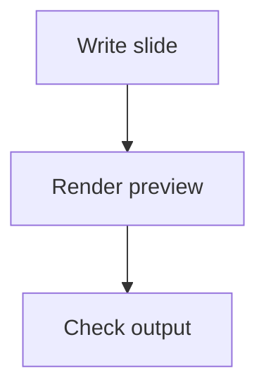

# Marp Slides Feature Test

A test deck to verify Marp slide syntax and rendering behavior in Xandria.

---

## Goal
Check core Marp slide features systematically.

- Slide separation with `---`
- Headings and paragraphs
- Bullet and numbered lists
- Emphasis: **bold**, *italic*, `inline code`
- Code fences
- Blockquotes
- Tables
- Images
- Links
- Speaker notes / comments behavior if applicable
- Math support if applicable
- Mermaid/code block preservation if applicable
- Theme/frontmatter handling
- Pagination and layout

---

## Basic formatting

### Text styles
- **Bold text**
- *Italic text*
- ~~Strikethrough~~
- `Inline code`

### Lists
1. First item
2. Second item
3. Third item

- Bullet one
- Bullet two
- Bullet three

> This is a blockquote for testing.

---

## Code block test

```python
for i in range(3):
    print("Hello Marp", i)
```

```json
{
  "slide": true,
  "feature": "code fence"
}
```

---

## Table test

| Feature | Expected result | Actual result |  | Status |
| --- | --- | --- | --- | --- |
| Frontmatter | Deck settings are recognized |  |  |  |
| Slide breaks | `---` creates new slides |  |  |  |
| Formatting | Bold/italic/code render correctly |  |  |  |
| Code blocks | Code is preserved and readable |  |  |  |
| Tables | Table renders correctly |  |  |  |
| Images | Images display correctly |  |  |  |

---

## Image test


- Check whether Marp image directives are preserved
- Check layout behavior
- Check image rendering after reopen


---

## Link test

- [Xandria](https://example.com)
- [Internal-style readable link placeholder](xandria://notes)

---

## Math test

Inline math: $E = mc^2$

Block math:

$$
\int_0^1 x^2 \, dx = \frac{1}{3}
$$

---

## Advanced math stress test

Inline examples: $\alpha, \beta, \gamma, \omega, \infty, \partial, \nabla, \forall x \in \mathbb{R}, \exists n \in \mathbb{N}$

$$
\lim_{n \to \infty} \sum_{k=1}^{n} \frac{1}{k^2} = \frac{\pi^2}{6}
$$

$$
\int_{-\infty}^{\infty} e^{-x^2} \, dx = \sqrt{\pi}
$$

$$
\frac{d}{dt} x(t) + 3x(t) = u(t), \qquad x(0) = x_0
$$

$$
X(\omega) = \int_{-\infty}^{\infty} x(t)e^{-j\omega t} \, dt
$$

$$
y[n] = \sum_{k=-\infty}^{\infty} h[k] \, x[n-k]
$$

$$
\prod_{m=1}^{n} m = n!, \qquad 0! = 1
$$

$$
\log_a b = \frac{\ln b}{\ln a}, \qquad e^{j\pi} + 1 = 0
$$

$$
\left( \frac{a+b}{c+d} \right)^2 = \frac{a^2 + 2ab + b^2}{(c+d)^2}
$$

$$
\mathbf{A} = \begin{bmatrix}
1 & 2 & 3 \\
0 & 1 & 4 \\
5 & 6 & 0
\end{bmatrix}, \qquad
\det(\mathbf{A}) = 1
$$

$$
\nabla f(x,y) = \begin{bmatrix} \frac{\partial f}{\partial x} \\ \frac{\partial f}{\partial y} \end{bmatrix}
$$

$$
P(A \mid B) = \frac{P(B \mid A)P(A)}{P(B)}
$$

---

## Mermaid preservation test



---

## Layout test

<!-- _class: lead -->

# Lead Slide

Testing slide class directives.

---

## Columns / mixed content test

| Left | Right |  |
| --- | --- | --- |
| Text content | More content |  |
| Another row | Another value |  |

---

## Checklist

- [ ] Frontmatter recognized
- [ ] Slides split correctly
- [ ] Formatting renders correctly
- [ ] Code blocks preserved
- [ ] Tables render correctly
- [ ] Images render correctly
- [ ] Links preserved
- [ ] Math works if supported
- [ ] Mermaid preserved if supported
- [ ] Reopen/save stability confirmed

---

## Notes

Record any rendering issues, unsupported syntax, or odd behavior here.
