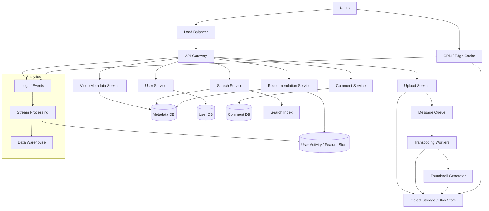

# Youtube System Design Interview

## Talking points
- Upload path: upload → object storage → queue → transcoding → thumbnails
- Serving path: users → CDN → metadata/API → video chunks from cache/storage
- Core services: auth/users, metadata, search, recommendations, comments
- Scale concerns: hot videos, caching, async processing, partitioning, replication
- Reliability: retries, idempotency, monitoring, multi-region CDN

