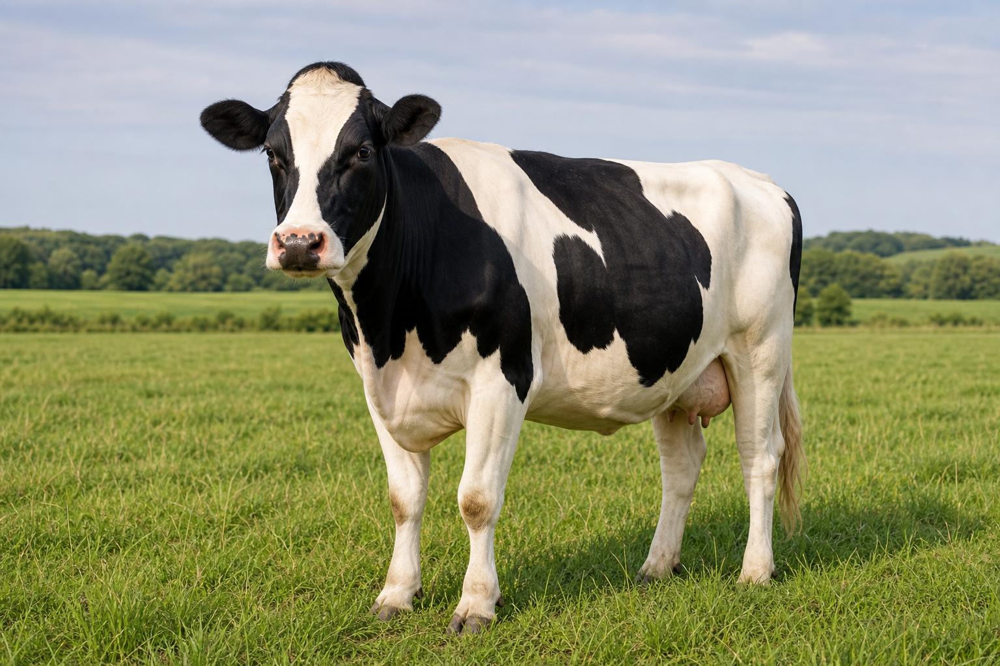
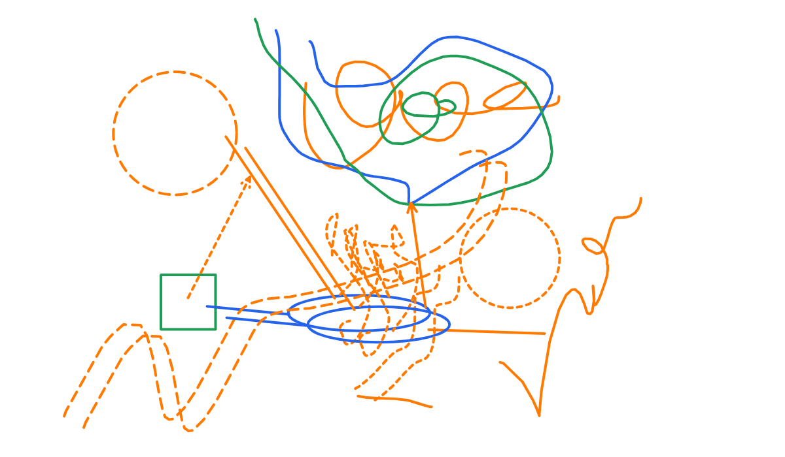

# Math
## Let's do maths

- meow meow
  - meow cat

$p = \pi$

---

# AI
## Let's do AI and ML

car is cat

### Various AI Approaches

| # | Approach | Category | Core idea | Typical methods/models | Strengths | Limitations | Common use cases |
|---|---|---|---|---|---|---|---|
| 1 | Rule-based AI | Symbolic AI | Uses explicit human-written rules for reasoning and decisions | If-then rules, expert systems, logic engines | Interpretable, predictable, easy to audit | Brittle, hard to scale, weak with ambiguity | Expert systems, compliance checks, diagnostics |
| 2 | Machine Learning | Data-driven AI | Learns patterns from data instead of relying only on hand-written rules | Regression, decision trees, SVM, random forests | Good performance on structured data, adaptable | Needs quality data and feature design | Classification, prediction, anomaly detection |
| 3 | Deep Learning | Neural-network-based ML | Learns hierarchical representations from large datasets | CNNs, RNNs, Transformers, autoencoders | Strong performance on images, text, audio | Data-hungry, compute-intensive, less interpretable | Vision, speech, NLP, generative AI |
| 4 | Reinforcement Learning | Sequential decision-making | Learns actions by maximizing reward through interaction with an environment | Q-learning, DQN, PPO, policy gradients | Good for control and long-term strategy | Sample inefficient, unstable training, reward design is hard | Robotics, games, autonomous control |
| 5 | Probabilistic AI | Uncertainty-aware AI | Models uncertainty explicitly using probability | Bayesian networks, HMMs, probabilistic graphical models | Handles uncertainty well, principled reasoning | Can be computationally expensive | Diagnosis, forecasting, sensor fusion |
| 6 | Evolutionary AI | Bio-inspired optimization | Searches for good solutions using mutation, selection, and recombination | Genetic algorithms, genetic programming, evolutionary strategies | Useful for hard optimization problems, gradient-free | Often slow, may not scale well | Design optimization, scheduling, controller tuning |
| 7 | Fuzzy AI | Approximate reasoning | Works with degrees of truth instead of strict binary logic | Fuzzy logic controllers, fuzzy inference systems | Good for vague or linguistic rules | Rule design can be manual and domain-specific | Control systems, consumer electronics, decision support |
| 8 | Hybrid AI | Combined paradigms | Integrates symbolic, statistical, or neural methods together | Neuro-symbolic systems, rule + ML pipelines | Balances interpretability and learning ability | More complex system design and maintenance | Robotics, enterprise AI, decision support |
| 9 | Generative AI | Content-generating AI | Produces new text, images, code, audio, or other content | LLMs, diffusion models, GANs, VAEs | Creative, flexible, strong for synthesis | Hallucinations, safety risks, high compute cost | Chatbots, coding assistants, media generation |

---

$$x = y$$

### Books to Read

| # | Title | Subject area |
|---|---|---|
| 1 | The Hero  - Preludes and Nocturnes 001 (1991) | Comic / Graphic fiction |
| 2 | Kingdom Come (2019) (digital) (Son of Ultron-Empire) | Comic / Superhero fiction |
| 3 | Blackest Night 10th Anniversary Omnibus v01 (2019) (hybrid) (Marika-Empire) | Comic / Superhero fiction |
| 4 | Batman - The Long Halloween (TPB) (1998) GetComics INFO | Comic / Crime / Superhero fiction |
| 5 | Batman - The Dark Knight Returns 30th Anniversary Edition (2019) | Comic / Dystopian superhero fiction |
| 6 | Once & Future v05 - The Wasteland (2023) | Comic / Fantasy fiction |
| 7 | Once & Future v04 - Monarchies in the U K (2022) | Comic / Fantasy / Mythic fiction |
| 8 | Once & Future v03 - The Parliament of Magpies (2021) | Comic / Fantasy fiction |
| 9 | Once & Future v02 - Old English (2020) | Comic / Fantasy / Arthurian fiction |
| 10 | Once & Future v01 (2020) | Comic / Fantasy fiction |

---

## This is some Test Diag

---

# How Xandria Works

- Xandria combines a reader, notes, library, search, and personal wiki in one workspace.
- The reader tracks books, PDFs, page locations, highlights, drawings, and source links.
- Notes can stay connected to the material they came from, so ideas can be traced back to the original page.
- Search and the knowledge graph connect books, notes, annotations, domains, and topics.
- The Agent uses current app context to answer questions and prepares changes for review before they are applied.

---

# US Politics

## How the US Government Is Structured

The US federal government has three branches:

- **Legislative** — Congress (Senate and House of Representatives) makes laws, controls the budget, and declares war.
- **Executive** — The President enforces laws, commands the military, conducts foreign policy, and can veto legislation.
- **Judicial** — The Supreme Court and lower federal courts interpret laws and review them for constitutionality.

A system of **checks and balances** keeps any one branch from becoming too powerful.

## Elections

Presidential elections happen every four years via the **Electoral College** — each state gets electors based on its congressional representation, and a candidate needs 270 of 538 electoral votes to win. Midterm elections (every two years) decide all House seats and about a third of Senate seats.

## Political Parties

Two major parties dominate:

- **Democratic Party** — generally center-left, supports social programs, healthcare reform, climate action, and regulation.
- **Republican Party** — generally center-right, supports lower taxes, free markets, strong military, and states' rights.

Third parties exist but rarely win national office due to the first-past-the-post voting system.

## Key Concepts

- **Federalism** — Power is divided between the national government and state governments.
- **Lobbying & Interest Groups** — Organizations try to influence lawmakers on specific issues.
- **The Media** — Acts as a watchdog but is also subject to polarization and bias.
- **Political Polarization** — The gap between the two major parties has grown significantly in recent decades, making compromise harder.

**Currently reading:**
- [Springer Handbook of Robotics — Bruno Siciliano](xandria://readable/read_02a91a9b-5398-413f-81ad-3a63c6c995de) (0%)
- [Automation, Production Systems and Computer-Aided Manufacturing — Mikell P. Groover](xandria://readable/read_acb7eb3f-5172-44ba-8566-a8d446f805f3) (6%)
- [Embedded Robotics — Thomas Bräunl](xandria://readable/read_8ce68d6d-c9a7-4014-a189-5444948e695b) (4%)
- [Robot Adventures in Python and C — Thomas Bräunl](xandria://readable/read_b142865b-3cb5-4f2e-a53b-e21b30a09f09) (0%)
- [Programming Robots with ROS — Morgan Quigley](xandria://readable/read_c9565143-7efb-4ade-9dd7-0ce7ecd84222) (0%)
- [ROS Robot Programming — YoonSeok Pyo](xandria://readable/read_7312d160-ba48-479d-9f64-38455654e00e) (0%)
- [Robotics Research — Kaneko & Nakamura](xandria://readable/read_8609e8b0-926e-4333-a493-0187238564e3) (65%)
- [Advanced Engineering Dynamics — H. R. Harrison](xandria://readable/read_bf9e42fd-be1f-46a5-b8c2-7f2f24236f74) (0%)

**Ready to start (unread):**
- [Introduction to Robotics — John J. Craig](xandria://readable/read_1ef42b1a-2e0f-4b78-9c1a-20be6f07a000)
- [Modern Robotics: Mechanics, Planning, and Control — Kevin M. Lynch](xandria://readable/read_b474f993-f1ee-4f76-aeec-67119270af2b)
- [Probabilistic Robotics — Sebastian Thrun](xandria://readable/read_3dc5a678-788f-4c2a-82f9-cd4df0513081)
- [Behavior-Based Robotics — Ronald Arkin](xandria://readable/read_825e14f2-0b1e-4c1c-9153-5937f00eff28)
- [Planning Algorithms — Steven M. LaValle](xandria://readable/read_8bbbfe67-ad45-40a9-babb-2a659ee54bdd)
- [Kalman and Bayesian Filters in Python — Roger R Labbe Jr](xandria://readable/read_d65f3b14-bcc5-4b1a-a4b0-23ddf2a8c074)
- [Make: Drones — David McGriffy

[0132642875.pdf, p. 8](xandria://reader/location?readableId=read_198a8f5a-01df-4594-a961-f35eb92431e5&locationKind=paged&pageIndex=7&normalizedY=0.5255)